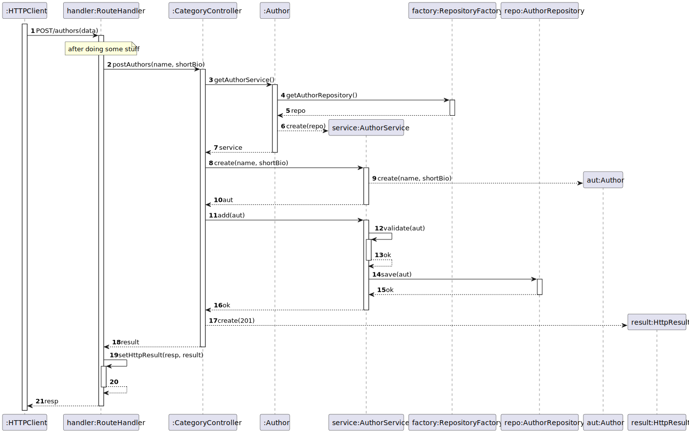
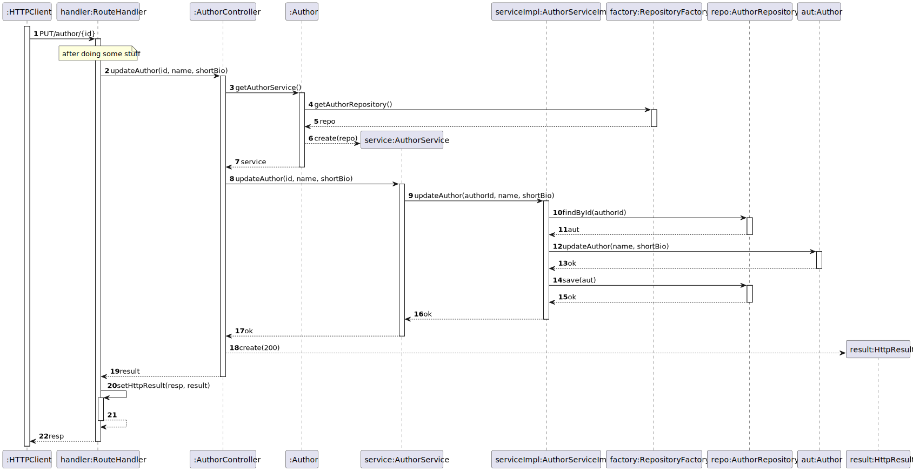
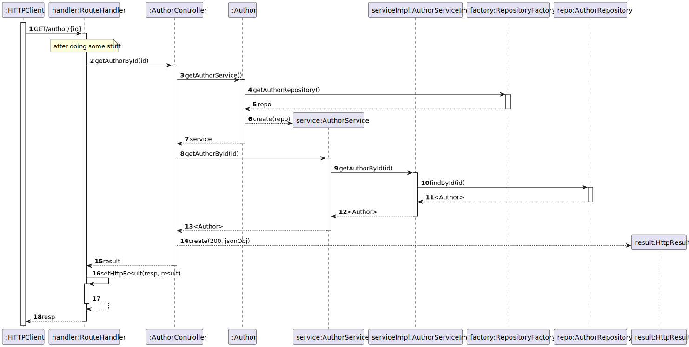
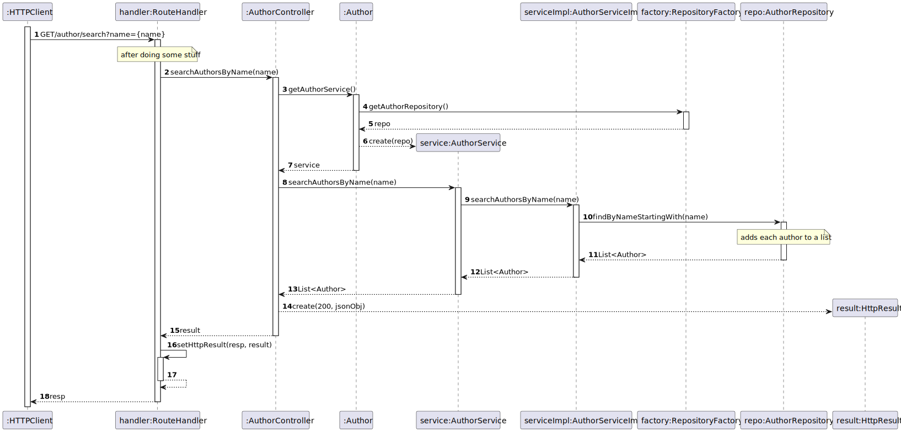

# US3 - Register an Author

## 1. Requirements Engineering

### 1.1. User Story Description

As Librarian I want to register an author (name, short bio)

### 1.2. Customer Specifications and Clarifications

**From the specifications document:**
Author as (name, short bio)

**From the client clarifications:**

> **Question 1:**
> Gostava de saber se quando o bibliotecário cria a bio do autor, apenas é constituído por texto ou tem outro campo?
  Aproveito e pergunto sobre o número do autor, se este é apenas um numero e como este é formado?
> Quão breve deverá ser a biografia? Existe um limite de caracteres?
> 
> **Answer 1:**
> A breve biografia do autor deve permitir conteudo HTML, o numero do autor é um número sequencial gerado pelo sistema.
> No máximo 4096 carcateres

> **Question 2:**
> Boa tarde, quais são os critério de aceitação (acceptance criteria) da us03?
> 
> **Answer 2:**
> Ao introduzir todos os dados obrigatórios no formato correto, o autor deve ficar registado no sistema
  Ao introduzir algum dado no formato incorreto ou não introduzir um dado obrigatório deve ser dada indicação de erro
  Apenas os utilizadores com permissões de librarian podem executar esta opção

> **Question 3:**
> É obrigatório preencher as caracteristicas do autor (name, short_bio) ? Ou apenas uma delas?
  Qual o minimo e o maximo de caracteres para um nome de um autor?
> 
> **Answer 3:**
> São ambas obrigatórias, um nome de author tem um máximo de 150 caracteres

> **Question 4:**
>Pode haver nomes repetidos entre autores?
> 
> **Answer 4:**
> Sim

### 1.3. Acceptance Criteria

* AC03-01: Ao introduzir todos os dados obrigatórios no formato correto, o autor deve ficar registado no sistema.
* AC03-02: Ao introduzir algum dado no formato incorreto ou não introduzir um dado obrigatório deve ser dada indicação de erro.
* AC03-03: Apenas os utilizadores com permissões de librarian podem executar esta opção.

## 2. Design - User Story Realization

### 2.1. Sequence Diagram (SD)

# US04 - Update an author’s data

## 1. Requirements Engineering

### 1.1. User Story Description

As Librarian I want to update an author’s data

### 1.2. Customer Specifications and Clarifications

**From the client clarifications:**

> **Question 1:**
> Que informações do autor é que o bibliotecário pode alterar?
>
> **Answer 1:**
> À exceção do "author number" pode alterar qualquer informação

> **Question 2:**
> Boa tarde, quais são os critério de aceitação (acceptance criteria) da us04?
>
> **Answer 2:**
> Podem alterar qualquer dado do autor excepto o número de autor
  Os dados introduzidos devem respeitar o formato correto
  Deve ser possível “limpar” os dados opcionais

### 1.3. Acceptance Criteria

* AC04-01: Podem alterar qualquer dado do autor excepto o número de autor.
* AC04-02: Os dados introduzidos devem respeitar o formato correto.
* AC04-03: Deve ser possível “limpar” os dados opcionais.

## 2. Design - User Story Realization

### 2.1. Sequence Diagram (SD)

# US05 - Get an author’s detail given its author number

## 1. Requirements Engineering

### 1.1. User Story Description

As Librarian or Reader I want to know an author’s detail given its author number

### 1.2. Customer Specifications and Clarifications

**From the client clarifications:**

> **Question 1:**
> Boa tarde, quais são os critério de aceitação (acceptance criteria) da us05?
>
> **Answer 1:**
> Se o utilizador introduzir um número de autor existente devem ser mostrados todos os dados do autor.
  Se o utilizador introduzir um número de autor inexistente deve ser indicado erro.

> **Question 2:**
> Na US05 é pedido que através do author number se obtenha todos os dados do autor, ou seja, nome e short bio?
>
> **Answer 2:**
> Sim.

### 1.3. Acceptance Criteria

* AC05-01: Se o utilizador introduzir um número de autor existente devem ser mostrados todos os dados do autor.
* AC05-02: Se o utilizador introduzir um número de autor inexistente deve ser indicado erro.

## 2. Design - User Story Realization

### 2.1. Sequence Diagram (SD)

# US06 - Get authors by name

## 1. Requirements Engineering

### 1.1. User Story Description

As Librarian or Reader I want to search authors by name

### 1.2. Customer Specifications and Clarifications

**From the client clarifications:**

> **Question 1:**
> Boa tarde, quais são os critério de aceitação (acceptance criteria) da us06?
>
> **Answer 1:**
> O utilizador introduz alguns caracteres e o sistema devolve a lista de todos os autores cujo nome começa pelas letras 
> introduzidas

### 1.3. Acceptance Criteria

* AC06-01: O utilizador introduz alguns caracteres e o sistema devolve a lista de todos os autores cujo nome começa 
            pelas letras introduzidas

## 2. Design - User Story Realization

### 2.1. Sequence Diagram (SD)

