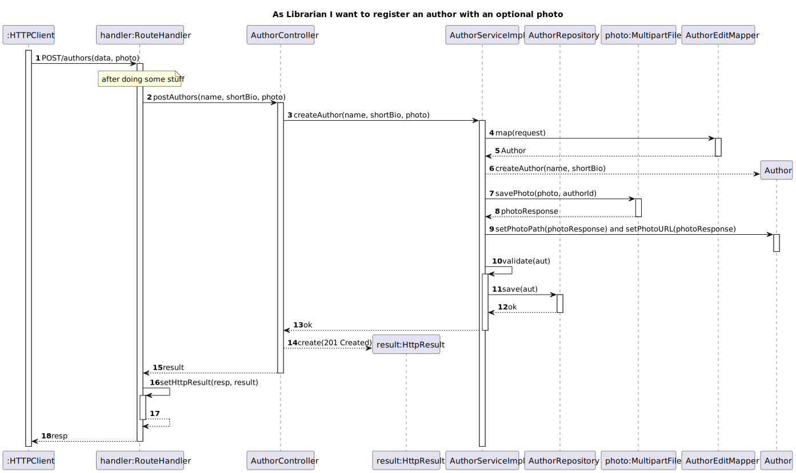

# US3 - Register an Author

## 1. Requirements Engineering

### 1.1. User Story Description

As Librarian I want to register an author (name, short bio, photo)

### 1.2. Customer Specifications and Clarifications

**From the specifications document:**
Author as (name, short bio)

**From the client clarifications:**

> **Question 1:**
> Gostava de saber se quando o bibliotecário cria a bio do autor, apenas é constituído por texto ou tem outro campo?
  Aproveito e pergunto sobre o número do autor, se este é apenas um numero e como este é formado?
> Quão breve deverá ser a biografia? Existe um limite de caracteres?
> 
> **Answer 1:**
> A breve biografia do autor deve permitir conteudo HTML, o numero do autor é um número sequencial gerado pelo sistema.
> No máximo 4096 carcateres

> **Question 2:**
> Boa tarde, quais são os critério de aceitação (acceptance criteria) da us03?
> 
> **Answer 2:**
> Ao introduzir todos os dados obrigatórios no formato correto, o autor deve ficar registado no sistema
  Ao introduzir algum dado no formato incorreto ou não introduzir um dado obrigatório deve ser dada indicação de erro
  Apenas os utilizadores com permissões de librarian podem executar esta opção

> **Question 3:**
> É obrigatório preencher as caracteristicas do autor (name, short_bio) ? Ou apenas uma delas?
  Qual o minimo e o maximo de caracteres para um nome de um autor?
> 
> **Answer 3:**
> São ambas obrigatórias, um nome de author tem um máximo de 150 caracteres

> **Question 4:**
>Pode haver nomes repetidos entre autores?
> 
> **Answer 4:**
> Sim

> **Question 5:**
>3. As Librarian I want to register an author with an optional photo
>4. As Reader I want to know the books of an Author
>5. As Reader I want to know the co-authors of an author and their respective books
>6. As Reader I want to know the Top 5 authors (which have the most lent books)
>
>Boa noite, gostaria de saber os critérios de aceitação. Obrigado
>
> **Answer 5:**
>3. As Librarian I want to register an author with an optional photo
>
>Os mesmos critérios do caso de uso do WP1 contemplando agora a possibilidade de adicionar uma imagem. ver no forum as perguntas relacionadas que já foram respondidas

### 1.3. Acceptance Criteria

* AC03-01: Ao introduzir todos os dados obrigatórios no formato correto, o autor deve ficar registado no sistema.
* AC03-02: Ao introduzir algum dado no formato incorreto ou não introduzir um dado obrigatório deve ser dada indicação de erro.
* AC03-03: Apenas os utilizadores com permissões de librarian podem executar esta opção.

## 2. Design - User Story Realization

### 2.1. Sequence Diagram (SD)

# US03 - Update an author’s data

## 1. Requirements Engineering

### 1.1. User Story Description

As Librarian I want to update an author’s data

### 1.2. Customer Specifications and Clarifications

**From the client clarifications:**

> **Question 1:**
> Que informações do autor é que o bibliotecário pode alterar?
>
> **Answer 1:**
> À exceção do "author number" pode alterar qualquer informação

> **Question 2:**
> Boa tarde, quais são os critério de aceitação (acceptance criteria) da us04?
>
> **Answer 2:**
> Podem alterar qualquer dado do autor excepto o número de autor
  Os dados introduzidos devem respeitar o formato correto
  Deve ser possível “limpar” os dados opcionais

### 1.3. Acceptance Criteria

* AC04-01: Podem alterar qualquer dado do autor excepto o número de autor.
* AC04-02: Os dados introduzidos devem respeitar o formato correto.
* AC04-03: Deve ser possível “limpar” os dados opcionais.

## 2. Design - User Story Realization

### 2.1. Sequence Diagram (SD)

# US04 - As Reader I want to know the books of an Author

## 1. Requirements Engineering

### 1.1. User Story Description

As Reader I want to know the books of an Author

### 1.2. Customer Specifications and Clarifications

**From the client clarifications:**

> **Question 1:**
>As Reader I want to know the books of an Author
> 
> **Answer 1:**
>Deve retornar a lista de livrso desse autor ou uma lista vazia. devem ter em consideração paginação se a lista for demasiado longa

## 2. Design - User Story Realization

### 2.1. Sequence Diagram (SD)

# US05 - As Reader I want to know the co-authors of an author and their respective books

## 1. Requirements Engineering

### 1.1. User Story Description

As Reader I want to know the co-authors of an author and their respective books

### 1.2. Customer Specifications and Clarifications

**From the client clarifications:**

> **Question 1:**
>As Reader I want to know the books of an Author
>As Reader I want to know the co-authors of an author and their respective books
>Como irá ser feita a pesquisa? Pelo nome do autor? Pelo authors number?
>
> **Answer 1:**
>Devem pensar em termos de recursos rest e em subrecursos, não em “pesquisas”

> **Question 2:**
>As Reader I want to know the co-authors of an author and their respective books
>
> **Answer 2:**
>Deve retornar uma lista com os autores que escreveram livros em conjunto com um dado autor. para cada coautor deve ser retornada alista de livros escritos em conjunto. devem ter em consideração paginação se a lista for demasiado longa

## 2. Design - User Story Realization

### 2.1. Sequence Diagram (SD)

# US06 - As Reader I want to know the Top 5 authors (which have the most lent books)

## 1. Requirements Engineering

### 1.1. User Story Description

As Reader I want to know the Top 5 authors (which have the most lent books)

### 1.2. Customer Specifications and Clarifications

**From the client clarifications:**

> **Question 1:**
>As Reader I want to know the Top 5 authors (which have the most lent books)
>
> **Answer 1:**
>Deve retornar os 5 autores com o maior numero de livros requisitados no ultimo ano

> **Question 2:**
>As Reader I want to know the Top 5 authors (which have the most lent books)
>O que é esperador retornar? Top 5 dos autores por ordem e ao lado o total de lendings de cada um deles?
> **Answer 2:**
>Sim
## 2. Design - User Story Realization

### 2.1. Sequence Diagram (SD)

